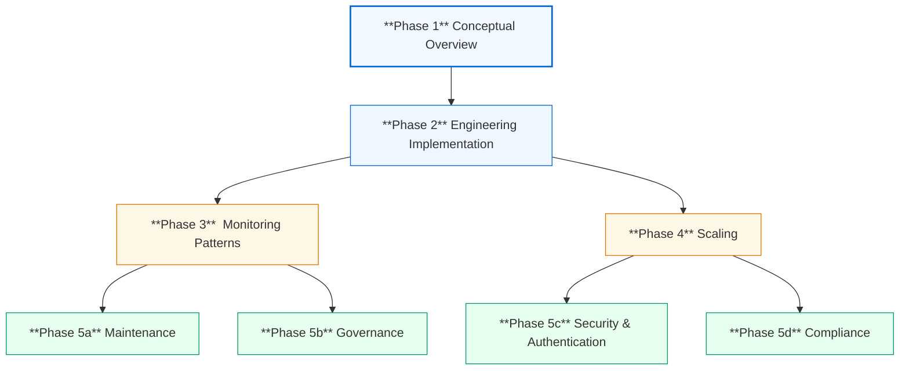

# OnG Upstream Data Management Case Study
An Oil & Gas data management &amp; visualisation architecture demo, with an end-to-end data engineering style using a scenario-based approach to illustrate a template-contract approach to organisation data management projects.

### Navigation / Quick Access
Quickly move to the section you are interested in by clicking on the appropriate link:

Overview
Phase 1 Preamble
Phase 2(Project Implementation)
Extensibility
Phase 5
Outcome

Project Objective
Project Architecture
Dataset
Reproducing Project (long section)
Dashboard

# Overview
------------------------------------------------------------------------------------------------------------------------------------------

## Scenario
-  A Data & AI consulting firm(hereafter called: D-Konsult) has been contracted by an Oil & Gas upstream research firm(hereafter called: GeoResults. As a major partner of D-Konsult, GeoResults has made demands of D-Konsult's executives, resulting in the Engineering & Analytics teams being placed under embargo - provide visible results ASAP. We will here-after then, scrutinize the different parts of the solution architecture that D-Konsult's team settle on/result to.

### Context
  - This project repository contains the primary building block for a real-time enabled Databricks Workspace, coupled with a dashboard engine to quickly visualize, share and design data products. 

### Technologies
- **Databricks**
- **Azure Cloud**
- **Terraform**
- **Github Actions**
- **Superset**

## Phases
- ***Phase 1***: High-level Conceptual Model
- ***Phase 2***: Engineering Patterns & Implementation
- ***Phase 3***: Delivery Patterns, Insights Generation
- ***Phase 4***: Scaling & Management
- ***Phase 5***: Governance & Compliance
 

# Phase 1
---------------------------------------------------------------------

I will leave potential discussions on the complexities of designing data architecture and project implementation documents for a second article. A lot of data management and governance issues flow downstream from these decisions, and I believe context determines how that is handled, but I will maintain the focus on tackling data processing and downstream tasks for this write-up.

# Phase 2
---------------------------------------------------------------------
### Navigation / Quick Access
Quickly move to the section you are interested in by clicking on the appropriate link:

Objectives
Architecture
Development

## Objectives

## Architecture

Overview
Every day, hundreds of earthquakes shake the earth — some minor, others devastating. Understanding where, when, and how they occur is crucial for monitoring natural hazards, informing infrastructure planning, and protecting communities.

This project extracts and analyzes real-time earthquake data from the United States Geological Survey (USGS), an agency that tracks seismic activity around the globe. The data is ingested daily via Azure Data Factory, transformed in Azure Databricks using the medallion architecture (bronze → silver → gold), stored in Microsoft Fabric Lakehouse, and visualized using Power BI.

The pipeline demonstrates how raw JSON data from a public API can be converted into structured, trusted insights using modern, cloud-native tools. By the end of the pipeline, users can explore:

🌍 Earthquake hotspots by country and region
📈 Magnitude trends over time
🚨 Significant seismic events by signal strength
🕒 Time-based patterns of earthquake activity
This project showcases how scalable data engineering workflows can power decision-ready dashboards, turning global sensor data into actionable intelligence for analysts, researchers, and the public.

Project Objective
✅ Automate daily ingestion of global earthquake data from the USGS API using Azure Data Factory
✅ Transform and enrich raw data using Azure Databricks with a medallion architecture (bronze → silver → gold)
✅ Store trusted and structured data in Microsoft Fabric Lakehouse
✅ Build interactive Power BI dashboards that uncover patterns, trends, and anomalies in global seismic activity
Project Architecture

This architecture illustrates the end-to-end data pipeline used in this project, leveraging Azure and Microsoft Fabric services to move from raw ingestion to visual insights.

🔄 End-to-End Pipeline Flow
🔁 Ingestion – Azure Data Factory

Daily earthquake data is ingested from the USGS API.
Azure Data Factory orchestrates the process and stores the data in Azure Data Lake.
⚙️ Transformation – Azure Databricks (Medallion Architecture)

Data is processed through three structured layers:
Bronze Layer: Raw ingestion and flattening
Silver Layer: Cleansing, filtering, standardization
Gold Layer: Aggregated and enriched for reporting
🏠 Storage – Microsoft Fabric Lakehouse

The gold-layer data is loaded into Microsoft Fabric Lakehouse for scalable storage and advanced analytics.
📊 Visualization – Power BI

Fabric Lakehouse feeds directly into Power BI, enabling dynamic dashboards and reports for stakeholders.
✅ This architecture ensures a reliable, scalable, and analytics-ready pipeline from API to dashboard.

Dataset
🌍 Source: USGS Earthquake API
This project collects seismic data from the United States Geological Survey (USGS) Earthquake API, which provides detailed information about global earthquake events.

API Endpoint: https://earthquake.usgs.gov/fdsnws/event/1/
Data Format: GeoJSON
Ingestion: Daily via Azure Data Factory
Dynamic Parameters:
starttime: set dynamically during ingestion
endtime: optional, defaults to the same as starttime
📘 API Documentation

Gold Layer Schema (Final Output)
The final dataset is produced in the gold layer after cleaning, enrichment, and transformation in Databricks. This output is ready for analytics or visualization.

|-- id: string (nullable = true)
|-- longitude: double (nullable = true)
|-- latitude: double (nullable = true)
|-- elevation: double (nullable = true)
|-- title: string (nullable = true)
|-- place_description: string (nullable = true)
|-- sig: long (nullable = true)
|-- mag: double (nullable = true)
|-- magType: string (nullable = true)
|-- time: timestamp (nullable = true)
|-- updated: timestamp (nullable = true)
|-- country_code: string (nullable = true)
|-- sig_class: string (nullable = false)

