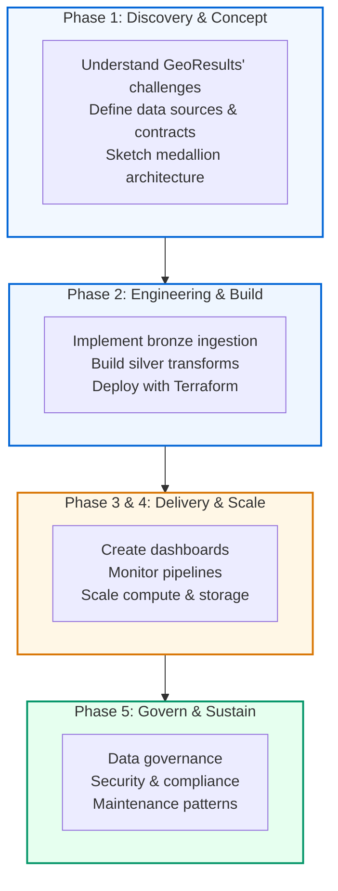
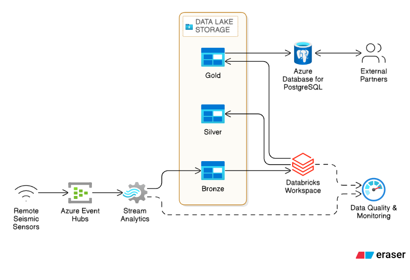

# OnG Upstream Data Management Case Study

An Oil & Gas data management & visualisation architecture demo, with an end-to-end data engineering style using a scenario-based approach to illustrate a template-contract approach to organisation data management projects.

## Navigation / Quick Access
Quickly move to the section you are interested in by clicking on the appropriate link:

* [Overview](#overview)
* [Phase 1(Preamble)](#phase-1)
* [Phase 2(Project Implementation)](#phase-2)
* [Extensibility](#extensibility)
* [Phase 5](#phase-5)
* [Outcome](#outcome)


## Overview
---------------------------------------------------------------------------------------

### Scenario
When D-Konsult accepted the GeoResults brief, the ask was simple and fierce: turn noisy, fast-moving field telemetry into reliable, shareable insights — and do it now. The team's pragmatic answer was a small, repeatable platform blueprint: schema-first ingestion, clear validation gates, staged transformations and lightweight dashboards that expose immediate value while remaining extensible.

#### Context
This repository captures that blueprint. It's a working catalogue of the building blocks required to stand up a near-real-time Databricks workspace backed by Terraform, bring raw sensor and event payloads into a bronze/raw landing zone, validate them against producer contracts, apply curated transformations into silver/gold datasets, and expose metrics via a dashboard engine.

#### Technologies
- **Databricks**
- **Azure Cloud**
- **Terraform**
- **Github Actions**
- **Superset**

### Audience & Purpose
This README speaks to data engineers, platform engineers and analytics practitioners who understand the medallion architecture pattern and want a concrete, opinionated template for building production data platforms on Databricks. The patterns and decisions here are transferable: swap Azure for AWS or GCP, Superset for Tableau, and the core logic remains. But we've chosen one stack to keep the story clear and the code runnable.

### What this repository contains
- `bronze_layer_ingest/` — ingestion scripts, schema validation logic and demo notebooks for the landing and raw zones
- `resources/contracts/` — JSON schema contracts that define expected producer payloads
- `silver_layer_transform/` — SQL queries and transformation examples for curated datasets
- `include/terraform-module/` — Terraform modules and environment-specific configs for provisioning Databricks workspaces and supporting infrastructure
- `notebooks/` — interactive Jupyter notebooks demonstrating pipeline logic, validation steps and analytics examples

### How to read this README
The README unfolds like a project narrative. Start with **Phase 1** to understand the conceptual model and the problems GeoResults faced. **Phase 2** shows how the team engineered the solution and where each piece of code lives. **Extensibility** explores how to adapt, scale and visualize the platform for different use cases. **Phase 5** tackles governance and compliance. **Outcome** wraps up with licensing and contact details.

### Phases
- ***Phase 1***: High-level Conceptual Model
- ***Phase 2***: Engineering Patterns & Implementation
- ***Phase 3***: Delivery Patterns, Insights Generation
- ***Phase 4***: Scaling & Management
- ***Phase 5***: Governance & Compliance
 



## Phase 1
---------------------------------------------------------------------

### The Problem: GeoResults' Data Chaos

GeoResults operates hundreds of wells and facilities across multiple geographies. Each site generates a torrent of sensor telemetry—wellhead pressures, flow rates, temperatures, maintenance alerts—streaming from incompatible systems, formats and timezones. The data arrived in CSV files, JSON blobs, and proprietary formats, often duplicated or incomplete. Analysts spent weeks wrangling the data before answering a single business question. The organisation had raw material for competitive advantage but no way to extract it fast enough.

### The D-Konsult Approach: Start Simple

Rather than chase a bespoke solution, D-Konsult's team proposed a pragmatic, repeatable blueprint: establish a single source of truth for raw data, validate it early using contracts, then layer curated datasets on top for different consumer needs. The philosophy was *schema-first* and *contract-driven*: producers (wells, facilities, IoT devices) must declare what they send; the platform validates, rejects or corrects; downstream consumers get clean, versioned data.

### Conceptual Model

The team sketched a simple data journey:

```
┌──────────────────────────────────────────────────────────────────────┐
│                        GeoResults Data Ecosystem                      │
└──────────────────────────────────────────────────────────────────────┘

   Producers                     Platform                    Consumers
   ──────────                    ────────                    ──────────

  Wells          ─┐                                           Geoscientists
  Facilities     ─┼──> [Landing]  ──> [Raw]  ──> [Silver] ──> Analysts
  Sensors        ─┤     (Bronze)       Zone      Focus      Reports
  Maintenance    ─┘
  Events
  
                       ↓ Validate Against Contracts
                       ↓ Schema + Data Quality
                       
                      [Gold]
                      ──────
                      → Dashboards
                      → APIs
                      → ML Features
```

**Bronze (Landing / Raw)**: Raw payloads land in cloud storage unchanged, with metadata about arrival time and source. A separate validation pass checks each payload against the producer contract, flagging mismatches.

**Silver (Curated)**: Cleaned, deduplicated, joined and enriched; structured for analytics. Each table is partitioned by date/facility for query efficiency. This is where analysts spend their time.

**Gold (Products)**: Highly specific datasets for dashboards, reports or machine learning. Aggregates, rolling metrics, and feature sets live here.

**Contracts**: Each producer publishes a JSON schema. The platform ingests and validates against it. If a well stops sending a pressure field, it fails validation and triggers an alert—not a silent data quality issue weeks later.

### Why This Model?

- **Immutability**: Raw data never changes; full audit trail preserved.
- **Fail-fast validation**: Catch data quality issues at ingestion, not downstream.
- **Decoupled consumers**: Analysts don't wait on raw schema changes; silver and gold layers are stable.
- **Scalability**: The layers separate compute needs: raw ingestion is light; silver transformations are heavy; gold exports are lightweight.


## Phase 2
---------------------------------------------------------------------
### Navigation / Quick Access
* [Objectives](#objectives)
* [Architecture](#architecture)
* [Development](#development)

### Objectives
---------------------------------------------------------------------
* ✅ Create a Databricks medallion data lake to wrangle, validate and stage raw upstream sensor and event streams
* ✅ Apply advanced data management and processing techniques (SQL, Python, partitioning, clustering, joins) to clean and enrich raw streams into curated silver datasets
* ✅ Provision scalable infrastructure (compute, storage, governance) using Terraform modules for staging and production environments
* ✅ Provide templates and examples for extending the platform to new data sources and consumer needs

### Architecture


The architecture is built on Databricks' managed lakehouse, which unifies data lake storage (Delta format) with SQL and Python compute. Raw data lands in Azure Blob Storage (or Data Lake Storage Gen2) and is catalogued in Databricks. The medallion layers are implemented as Delta tables:

- **Bronze**: Raw payloads, landing zone tables grouped by producer (wells, facilities). Ingestion jobs read from cloud storage and write raw records as-is.
- **Silver**: Cleaned, validated tables with partitioning (by date, facility) and basic aggregations. Ingestion and validation scripts ensure data quality before promotion to silver.
- **Metadata**: Schema contracts, validation rules, lineage tracking—tracked alongside data to maintain trust and auditability.

### Development
---------------------------------------------------------------------

This section maps repository artifacts to the medallion layers and shows how to run the code.

#### Bronze Layer: Ingestion & Landing

The `bronze_layer_ingest/` folder contains Python scripts and Jupyter notebooks for bringing raw data into the landing and raw zones.

**Files:**
- `ingestion_landing_zone.py` — Reads raw payloads from cloud storage and writes them to the bronze landing table, preserving original format and metadata.
- `ingestion_raw_zone.py` — Reads landing records, validates against producer contracts (from `resources/contracts/`), applies basic transformations (e.g., type coercion), and writes to the raw table.
- `raw_zone_schema_validation.py` — Validates incoming JSON payloads against contract schemas; used as a reusable library by the ingestion pipeline.

**Notebooks** (in `bronze_layer_ingest/notebooks/`):
- `Landing Zone Pipeline SCRIPT.ipynb` — walkthrough of the landing zone ingestion, how to run locally and submit to Databricks.
- `Raw Zone Schema Validation Pipeline SCRIPT.ipynb` — demonstrates validation logic and error handling.


#### Silver Layer: Transformation & Curation

The `silver_layer_transform/` folder contains SQL transformation examples.

**Files:**
- `new_query.sql` — Example aggregation query that combines well telemetry and facility metadata to produce a curated dataset (e.g., rolling 24-hour averages by facility).

#### Infrastructure: Terraform Modules

The `include/terraform-module/` folder contains Terraform code to provision the Databricks workspace and supporting cloud resources.

**Files:**
- `modules/databricks/` — Databricks workspace, cluster configs, and permissions.
- `modules/stream-analytics/` — (Optional) Azure Stream Analytics jobs for real-time ingestion.
- `production/main.tf`, `variables.tf`, `env.txt` — Production environment config.
- `staging/main.tf`, `variables.tf` — Staging environment config.

**How to deploy:**
```bash
cd include/terraform-module/staging (terraform-module is the attached submodule repository)
Provide the necessary secrets to allow access to your Azure cloud for deployment,
Run Github Actions Workflow
```

**How to use:**
- Once the infrastructure is provisioned, provide the necessary secrets for the repo to be deployed to the workspace
- Access the pipeline definitions and SQL scripts within the Databricks Workspace
- Adapt the table names and field names to match your schema.
- Create a view or materialized table to expose curated data to consumers.

#### Data Contracts

Schemas are defined in `resources/contracts/`. Each producer (well, facility, sensor) has a contract file (e.g., `well-telemetry.json`):

```json
{
  "$schema": "http://json-schema.org/draft-07/schema#",
  "type": "object",
  "properties": {
    "well_id": { "type": "string" },
    "timestamp": { "type": "string", "format": "date-time" },
    "pressure_psi": { "type": "number" },
    "flow_rate_bbl_d": { "type": "number" }
  },
  "required": ["well_id", "timestamp", "pressure_psi"]
}
```

The validation script (`raw_zone_schema_validation.py`) loads these contracts and rejects or flags any payloads that don't conform. This keeps data quality high and makes debugging easy.


## Extensibility
---------------------------------------------------------------------

With bronze and silver layers delivering clean, trusted data, the platform opened new possibilities. Extensibility is about putting that data in the hands of different consumers—analysts, geoscientists, dashboards, ML pipelines—each with their own needs and tools.

### Visualization: Dashboards & Insights

**Superset Integration**

D-Konsult connected Superset to a Databricks SQL endpoint, exposing silver and gold datasets as queryable sources. Analysts built dashboards in minutes—no more waiting for a data engineer to write a SQL export.

**Example dashboards:**
- **Real-time Well Performance**: Pressure, flow rate and temperature trends by well, with alerts for anomalies.
- **Facility Utilization**: Aggregate metrics across all wells in a facility; identify bottlenecks and optimization opportunities.
- **Data Quality Dashboard**: Schema validation pass rates, ingestion latency, and alert history—operational transparency.

**How to connect Superset:**
1. Set up a Databricks SQL endpoint (or use the default warehouse).
2. In Superset, add a new database connection: choose Databricks dialect, provide host, token and catalog/schema.
3. Browse silver and gold tables; create charts and dashboards interactively.

### Extending for New Data Sources

The pattern scales easily. When GeoResults wanted to ingest surface equipment telemetry (in addition to wellhead data), the team:

1. **Defined a contract** in `resources/contracts/equipment-telemetry.json` (already in the repo).
2. **Extended the ingestion scripts** to handle the new producer type.
3. **Added validation and transformation** in the raw and silver layers.
4. **Exposed new dashboards** in Superset.

The medallion architecture decouples producers from consumers, so adding a new data source doesn't break existing pipelines.

### Scaling: From Pilot to Enterprise

As data volumes grew, the team evolved the platform:

**Compute Scaling:**
- Auto-scaling Databricks clusters: add workers as ingestion and transformation jobs demand compute.
- Partition silver tables by (date, facility) to enable fast queries and efficient incremental updates.
- Use clustering keys (e.g., well_id) to optimize join performance.
- All managed programmatically using Terraform

**Storage Scaling:**
- Delta Lake's ACID semantics and time-travel features support large-scale data operations without data loss.
- Databricks automatically handles metadata and indexing.
- Archive old bronze data to cheaper tiers (e.g., Azure Archive Storage) after a retention period.

**Job Orchestration:**
- Use Databricks Workflows (or Azure Data Factory, if preferred) to schedule and monitor pipelines.
- Set up alerting for pipeline failures or data quality issues.

**Terraform Modules for Scale:**
The `include/terraform-module/modules/` include reusable configurations:
- `databricks/` — cluster sizing, autoscaling policies, and permissions.
- `stream-analytics/` — real-time ingestion if using Azure Stream Analytics.

Adapting for production scale: update environment variables in `include/terraform-module/production/env.txt`, adjust cluster node types and worker counts, and test with realistic data volumes.

### Tailoring for Other Scenarios

The blueprint is domain-agnostic. The same pattern works for IoT sensor networks, manufacturing, financial transactions, or any high-volume, low-latency data problem:

- **Swap producers**: instead of wells/facilities, use wind turbines, RFID readers, or payment terminals.
- **Adapt contracts**: update JSON schemas to match your domain's payloads.
- **Reuse transformations**: the SQL and Python patterns (partitioning, joins, aggregations) are universal.
- **Extend dashboards**: connect new metrics and add domain-specific KPIs to Superset.

The code is yours to fork and adapt.


## Phase 5
---------------------------------------------------------------------

### Governance: Keeping Data Trustworthy

By Phase 5, GeoResults had thousands of tables, millions of records, and dozens of users. Maintaining trust and compliance became mission-critical.

### Data Contracts as Governance

The JSON schemas in `resources/contracts/` are the foundation. They enforce:
- **Data ownership**: Which producer owns each field?
- **Data lineage**: Which transformations created this table?
- **Change control**: Schema changes are versioned and audited.

When a well's sensor upgrade changes the schema, the contract is updated, validated, and tracked in version control—giving analysts confidence that historical and new data are consistent.

### Access Control & Permissions

Databricks workspaces support granular role-based access control (RBAC):
- **Data Engineers** have admin access to all clusters and tables; they run ingestion and transformation jobs.
- **Analysts** have read access to silver and gold tables only; they query via Databricks SQL or Superset.
- **Geoscientists** have read access to domain-specific gold datasets (e.g., aggregated metrics by facility).

Set up and manage with Terraform (`include/terraform-module/modules/databricks/`).

### Secrets & Credentials

- Store cloud credentials (Azure connection strings, storage keys) in Databricks Secrets or Azure Key Vault.
- Reference them in ingestion scripts using `dbutils.secrets.get("scope", "key")`.
- Never commit secrets to git.

### Audit & Compliance

Databricks logs all data access and modifications. For compliance (GDPR, SOX, etc.):
- Enable audit logging via Databricks workspace settings.
- Export logs to an immutable storage system (e.g., Azure Archive Storage).
- Use Delta Lake's time-travel feature to reconstruct historical data for audits.

### Data Retention & Deletion

Define retention policies in code (e.g., "keep bronze data for 90 days; archive to cold storage"):

```python
from datetime import datetime, timedelta

retention_days = 90
cutoff_date = (datetime.utcnow() - timedelta(days=retention_days)).date()

# Delete old bronze data
spark.sql(f"""
  DELETE FROM bronze.landing_zone 
  WHERE date(arrival_timestamp) < '{cutoff_date}'
""")
```

Integrate into scheduled jobs to automate cleanup.

### CI/CD & Deployment Governance

Use GitHub Actions to enforce code and data quality gates:

- **Validate** ingestion scripts and notebooks for syntax errors before merge.
- **Test** transformations against sample data.
- **Approve** terraform changes before applying to production.
- **Track** schema changes across environments (staging → prod).

Example workflows which can be extended can be found under the .github/workflows directories for both repositories:


(Adapt and expand based on your testing and deployment needs.)


## Outcome
---------------------------------------------------------------------

### Project Results

By the end of Phase 5, D-Konsult's team had delivered:

- ✅ A schema-first, contract-driven data platform that ingests, validates and curates upstream telemetry at scale.
- ✅ Reusable Terraform modules and the Databricks medallion architecture—ready to extend or replicate.
- ✅ Real-time dashboards and analytics tools that let GeoResults answer questions in hours, not weeks.
- ✅ A governance and compliance framework that keeps data trustworthy and auditable.

The platform was adopted across GeoResults' operations, driving decisions on field optimization, maintenance scheduling and resource allocation.

### License

This project is distributed under the terms of the [LICENSE](LICENSE) file included in this repository. Refer to it for reuse, modification and distribution rights. Appreciation goes to the team at [**Beyond Data Network**](https://home.bdatanet.tech) for supporting and provding the resources which these demo is based on.

### Contributing

We welcome contributions, feedback and use-case adaptations. To contribute:

1. Fork this repository.
2. Create a feature branch (`git checkout -b feature/your-feature`).
3. Make your changes and add tests if applicable.
4. Commit with clear messages (`git commit -am 'Add [feature]'`).
5. Push to your fork and open a pull request.

**Please avoid committing**:
- Secrets, credentials, or API keys (use environment variables or Databricks Secrets).
- Large data files or model artifacts.
- Uncommitted Terraform state files.

### Contacts & Support

For questions, ideas or general feedback on this platform template:

- **Email**: [onidajo99@gmail.com, engineering@bdatanet.tech]
- **Issues**: Open an issue on this repository with a clear description of the problem or feature request.
- **Discussions**: Start a discussion for architecture or design questions.

### Next Steps & Future Work

The platform is production-ready but always evolving. Potential enhancements:

- **Real-time dashboards**: Integrate Databricks incremental refresh with lower-latency visualization tools.
- **Predictive maintenance**: Build ML models on gold datasets to predict equipment failure.
- **Data monetisation**: Package curated datasets for external consumers.
- **Multi-cloud support**: Extend Terraform modules for AWS or GCP.
- **Observer patterns**: Deploy data quality and freshness monitoring via Great Expectations or Soda.

See [CONTRIBUTING.md](CONTRIBUTING.md) for details on how to propose and implement enhancements.

---

**Thank you for reading.** We hope this platform blueprint accelerates your data engineering journey. Fork, adapt and build—the data is yours to wrangle.
